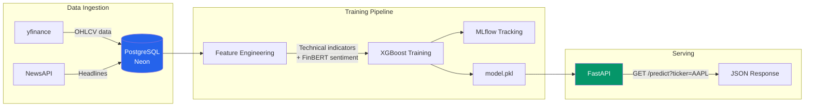
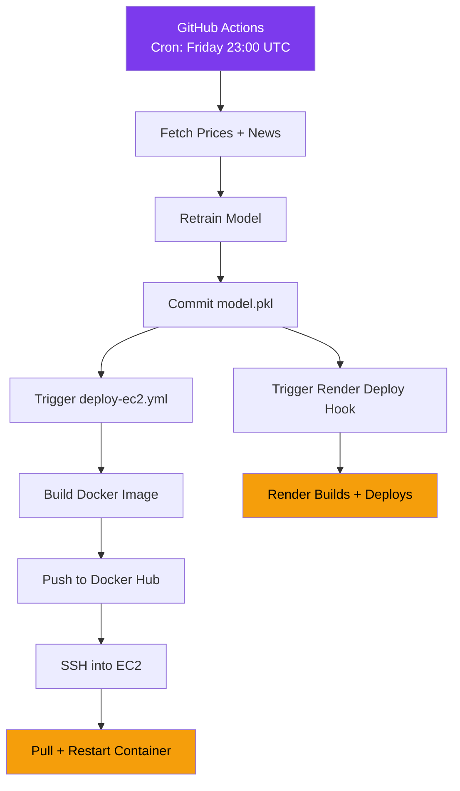

# MarketPulse

An end-to-end ML pipeline that predicts whether a stock or crypto ticker will close **up or down the next trading day**. It ingests daily price data and financial news, engineers technical and sentiment features, trains an XGBoost classifier, and serves predictions through a FastAPI REST API. The pipeline retrains itself automatically every week via GitHub Actions and redeploys to both AWS EC2 and Render.

> **Live API:**
> [AWS EC2](http://16.192.127.144:8000/docs) | [Render](https://market-oracle.onrender.com/docs)

---

## Architecture



## Deployment Flow




## Features

**Data ingestion** — `fetch_prices.py` pulls daily OHLCV data for a configurable list of stocks and crypto tickers via yfinance with incremental backfill. `fetch_news.py` pulls recent headlines per ticker from NewsAPI for sentiment scoring.

**Feature engineering** — Technical indicators include daily return, 7/21-day moving averages, MA ratio, RSI, MACD, stochastic oscillator, 7-day volatility, and volume change. News headlines are scored with FinBERT (`ProsusAI/finbert`) and aggregated into a daily sentiment score per ticker. The binary target is whether the next day's close is higher than today's.

**Model training** — An XGBoost classifier trained with a chronological 80/20 split to avoid lookahead bias, with class-imbalance handling via `scale_pos_weight`. Runs and metrics (accuracy, precision, recall, F1) are tracked with MLflow.

**Serving** — A FastAPI service exposes `GET /predict?ticker=<TICKER>` returning predicted direction, confidence, and prediction date, alongside a `GET /` health check.

**Storage** — PostgreSQL hosted on Neon with three tables (`prices`, `news`, `features`), each keyed to avoid duplicate inserts.

**Automation** — A weekly GitHub Actions workflow fetches latest data, retrains the model, commits the updated artifact, and triggers redeployment on both Render and AWS EC2.

**Deployment** — Containerized with Docker and deployed on Render (free-tier web service) and AWS EC2 (t3.micro) via Docker Hub with automated CI/CD.

---

## Tracked Assets

| Type   | Tickers                                    |
|--------|--------------------------------------------|
| Stocks | AAPL, MSFT, GOOGL, TSLA, JPM, JNJ         |
| Crypto | BTC-USD, ETH-USD, SOL-USD, BNB-USD        |

Configurable in `market-oracle/config.py`.

---

## Tech Stack

| Category     | Tools                                          |
|--------------|------------------------------------------------|
| Language     | Python 3.12                                    |
| API          | FastAPI, Uvicorn                               |
| ML           | XGBoost, scikit-learn, FinBERT, MLflow         |
| Data         | PostgreSQL (Neon), yfinance, NewsAPI           |
| Infra        | Docker, AWS EC2, Render, GitHub Actions        |
| Planned      | Streamlit (UI), Evidently AI (monitoring)      |

---

## Project Structure

```
Market_Analysis/
├── render.yaml                            # Render deployment config
├── .github/workflows/
│   ├── weekly_app_update.yaml             # Weekly retrain + Render deploy
│   └── deploy-ec2.yml                     # AWS EC2 deployment
└── market-oracle/
    ├── app.py                             # FastAPI prediction service
    ├── config.py                          # Tickers, DB config, news API config
    ├── db.py                              # PostgreSQL connection + schema + upserts
    ├── fetch_prices.py                    # Price ingestion (yfinance)
    ├── fetch_news.py                      # News ingestion (NewsAPI)
    ├── train.py                           # Feature engineering + model training
    ├── drift.py                           # Data/model drift checks (in progress)
    ├── feature_engineering.ipynb          # Exploratory notebook
    ├── models/model.pkl                   # Latest trained model artifact
    ├── mlruns/, mlflow.db                 # MLflow experiment tracking
    ├── requirements.txt                   # Runtime (API) dependencies
    ├── requirements-train.txt             # Training pipeline dependencies
    └── Dockerfile
```

---

## Getting Started

### Prerequisites

- Python 3.12
- A PostgreSQL database (e.g. a free [Neon](https://neon.tech/) instance)
- A [NewsAPI](https://newsapi.org/) API key

### Setup

1. **Clone and install:**

   ```bash
   git clone https://github.com/AmitojSinghChawla/Market_Analysis.git
   cd Market_Analysis/market-oracle
   pip install -r requirements-train.txt
   ```

2. **Configure environment variables** — create a `.env` file in the project root:

   ```env
   DB_NAME=market_pulse
   DB_USER=your_db_user
   DB_PASSWORD=your_db_password
   DB_HOST=your_db_host
   DB_PORT=5432
   NEWS_API_KEY=your_newsapi_key
   ```

3. **Initialize the database:**

   ```bash
   python db.py
   ```

4. **Run the pipeline:**

   ```bash
   python fetch_prices.py
   python fetch_news.py
   python train.py
   ```

5. **Serve predictions locally:**

   ```bash
   uvicorn app:app --reload
   curl "http://localhost:8000/predict?ticker=AAPL"
   ```

### Running with Docker

```bash
docker build -t marketpulse -f market-oracle/Dockerfile market-oracle
docker run -p 8000:8000 --env-file .env marketpulse
```

---

## Deployment

### Render

Render hosts the FastAPI service as a Docker web service, defined in `render.yaml`. The weekly GitHub Actions workflow triggers a Render deploy hook after each retrain.

### AWS EC2

A separate GitHub Actions workflow (`deploy-ec2.yml`) builds the Docker image, pushes it to Docker Hub, and SSHs into an EC2 instance to pull and restart the container. This workflow triggers automatically after the main retrain workflow completes.

---

## Roadmap

- **Streamlit front-end** — a user-facing dashboard to search tickers, view predictions, visualize price history, technical indicators, and sentiment trends.
- **Model monitoring with Evidently AI** — detect data drift, concept drift, and prediction quality decay as part of the weekly retraining pipeline.
- **Expanded ticker universe** — support user-added tickers and broader market coverage.
- **Multi-horizon predictions** — extend beyond next-day direction to multi-day forecasts.
- **API hardening** — authentication, rate-limiting, and input validation on the public endpoint.

---

## Contributing

Contributions are welcome. Please open an issue to discuss proposed changes before submitting a pull request.

## License

No license file is currently included in this repository.
